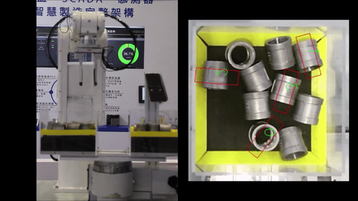
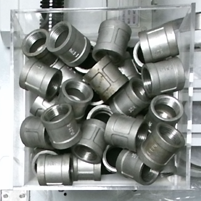
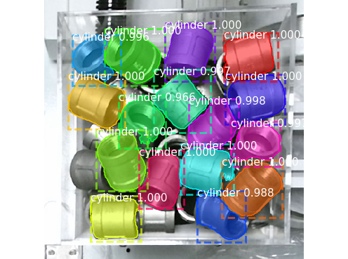
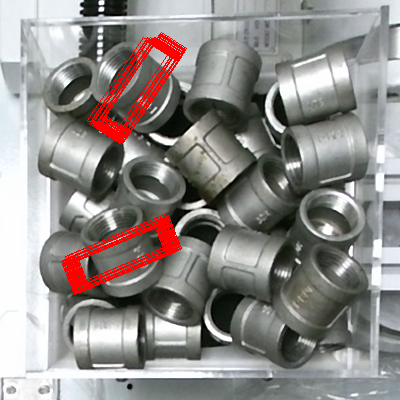
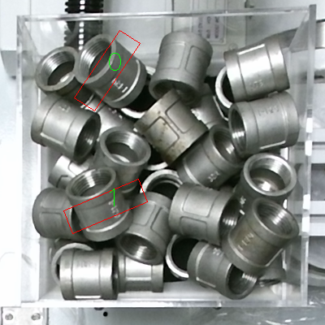
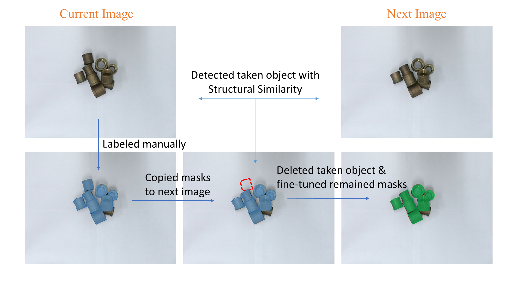
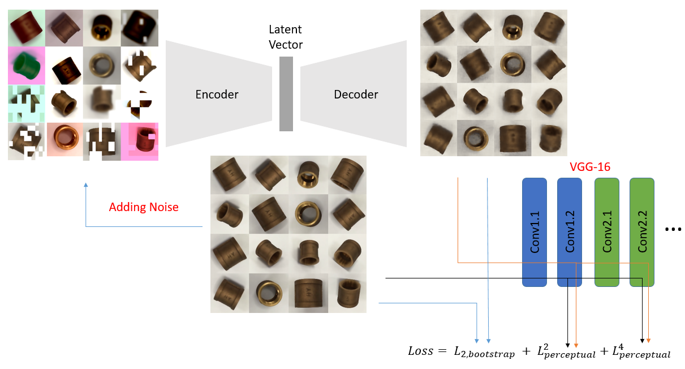

# Robot Grasping in Dense Clutter

## Overview
This repository contains an implementation of our proposed algorithm for grasp detection in dense clutter. The algorithm consists of three steps: instance segmentation, view-based experience transfer and optimal grasp determination.

* Instance Segmentation - [Mask R-CNN](#mask-r-cnn) is adopted to segment easy-to-grasp objects from a clutter scene.
* View-based Experience Transfer - [Denoise Autoencoder](#denoise-autoencoder) is used to estimate corresponding view of each segmented object. Then, grasp experiences can be transfered onto a clutter scene.

The system consisting of a six-axis robot arm with two-jaw parallel gripper and Kinect V2 RGB-D camera is used to evaluate the success rate for grasping in dense clutter. The grasping results on cluttered metal parts show that the success rate is about 94%.

<p align = "center">
    <b>Demonstration of the hand-eye system and the algorithm</b><br>
    
</p>
<p align = "center">
    <b>Demonstration of two types of grasping methods</b><br>
    
</p>

For more information about our approach, please check out our [summary video](https://youtu.be/Xo3BYjhgWlg) and our paper:

### Robot Grasping in Dense Clutter via View-Based Experience Transfer
Jen-Wei Wang and Jyh-Jone Lee
### Contact
If you have any questions, please mail to [Jen-Wei Wang](mailto:r06522620@ntu.edu.tw)

## Quick Start
To run this code, please navigate to algorithm.
```bash
cd algorithm
```
### Installation
This code was developed with Python 3.5 on Ubuntu 16.04 and NVIDIA 1080ti.
Python requirements can be installed by:
```bash
pip install -r requirements.txt
```
There are two pre-trained models:
* Mask R-CNN can be downloaded at [here](https://drive.google.com/file/d/1lfP87WK6hXAL0mXCnAIlUuIO8tYX4uXK/view?usp=sharing)
* Denoise Autoencoder is included in three files named as chkpt-80000.

### Evaluation
Testing images are provided at [test_images](https://github.com/WilliamWang303/dense-clutter-grasp/tree/master/algorithm/test_images).
Run our code on testing images:
```bash
python detection_algorithm.py --rgb=./test_images/rgb.png --depth=./test_images/depth.png
```
Testing results will be saved at test_images.
| Clutter Scene | Segmentation | Collision-Free Grasps | Optimal Grasps |
:-------------------------:|:-------------------------:|:-------------------------:|:-------------------------:
 |  |  | 

config.yaml contains some parameters than can be adjusted.

## Mask R-CNN
The code for Mask R-CNN is based on [repository](https://github.com/matterport/Mask_RCNN) implemented by matterport.

### Dataset
The annotated dataset is provided at [here](https://drive.google.com/drive/folders/1BXdSlEGf4vv-rUGe0l05_tXoTxrMbwU1?usp=sharing).
We improve the data-collecting and labeling process. The details are shown in following figure and our paper.


### Train
To prevent over-fitting, the revisions are:
* Use pre-trained ResNet-50 as backbone
* Fine-tune parameters not in the backbone
* Reduce types of anchors from 5 to 3

### Evaluation
The results of mAP for RGB and RGB-D image as two types of inputs are respectively, 0.901 and 0.924.

## Denoise Autoencoder
The code for Denoise Autoencoder is based on [repository](https://github.com/DLR-RM/AugmentedAutoencoder) implemented by DLR-RM.
To estimate views more correctly, we redefine the loss function as L2 loss plus perceptual loss. The details are shown in following figure and our paper.


### Dataset
The object views and their corresponding grasp experiences are provided at [here](https://drive.google.com/drive/folders/11vckK7rj3Ahlt9ytszu75ZIDbyNlRu2P?usp=sharing)

### Train
1. Download pre-trained vgg-16 model at [here](https://drive.google.com/file/d/1sPQPy8hudhlaVKGl4awWb60ydJmk-SP-/view?usp=sharing) and put the model to the [directory](https://github.com/DLR-RM/AugmentedAutoencoder/tree/master/auto_pose/ae).
2. Put our provided files in denoise_ae folder to the same directory.
3. Start training with the same process explained in the [repository](https://github.com/DLR-RM/AugmentedAutoencoder).

### Evaluation
The recall of pose estimation on T-LESS dataset is about 50.31.
